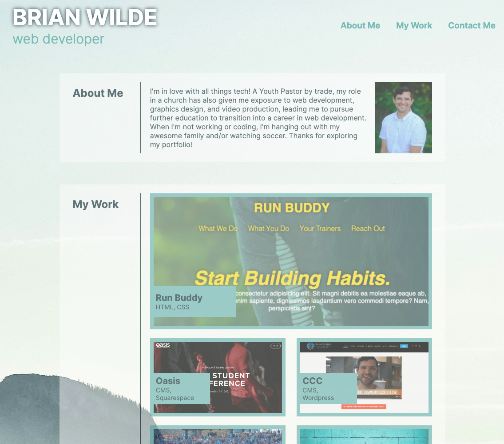
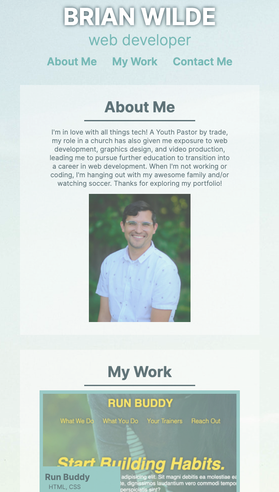

# Brian Wilde's Web Portfolio

## DESCRIPTION
Originially created as a test of my growing knowledge base in HTML and CSS, this will continue to have links to web projects I create in the future. 

I enjoyed building this portfolio from scratch while utlizing the following techniques new to me:
* Flexbox
* Media Queries
* Pseudo Classes

This page is viewable at https://bgswilde.github.io/wilde-portfolio/

See screenshots for desktop and mobile page layouts:

## CREDITS
The Content Management page links I included are pages I actively manage and create content for. I am not responsible for the original design of the CCC website, which was designed by Evans Design Co. However, I am responsible for the layout on several of the indpages, including elements of the homepage and creation of the page content. 

## LICENSE
 MIT License

Copyright (c) 2021 Brian Wilde

Permission is hereby granted, free of charge, to any person obtaining a copy
of this software and associated documentation files (the "Software"), to deal
in the Software without restriction, including without limitation the rights
to use, copy, modify, merge, publish, distribute, sublicense, and/or sell
copies of the Software, and to permit persons to whom the Software is
furnished to do so, subject to the following conditions:

The above copyright notice and this permission notice shall be included in all
copies or substantial portions of the Software.

THE SOFTWARE IS PROVIDED "AS IS", WITHOUT WARRANTY OF ANY KIND, EXPRESS OR
IMPLIED, INCLUDING BUT NOT LIMITED TO THE WARRANTIES OF MERCHANTABILITY,
FITNESS FOR A PARTICULAR PURPOSE AND NONINFRINGEMENT. IN NO EVENT SHALL THE
AUTHORS OR COPYRIGHT HOLDERS BE LIABLE FOR ANY CLAIM, DAMAGES OR OTHER
LIABILITY, WHETHER IN AN ACTION OF CONTRACT, TORT OR OTHERWISE, ARISING FROM,
OUT OF OR IN CONNECTION WITH THE SOFTWARE OR THE USE OR OTHER DEALINGS IN THE
SOFTWARE.

